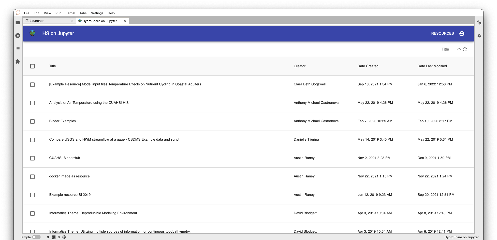
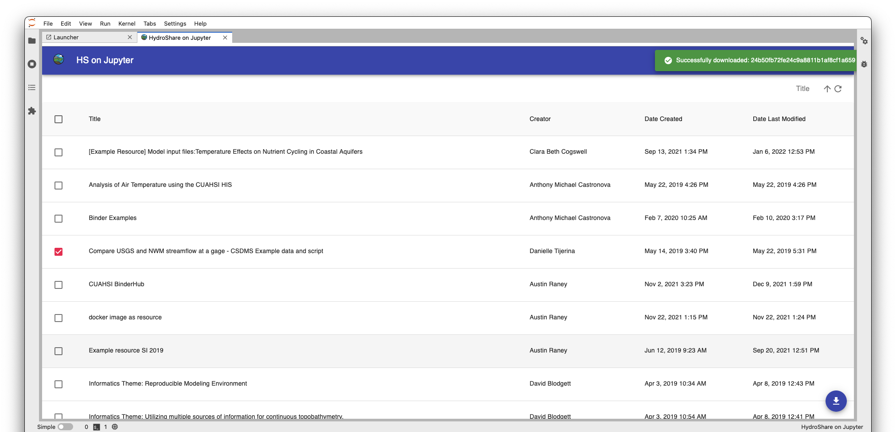
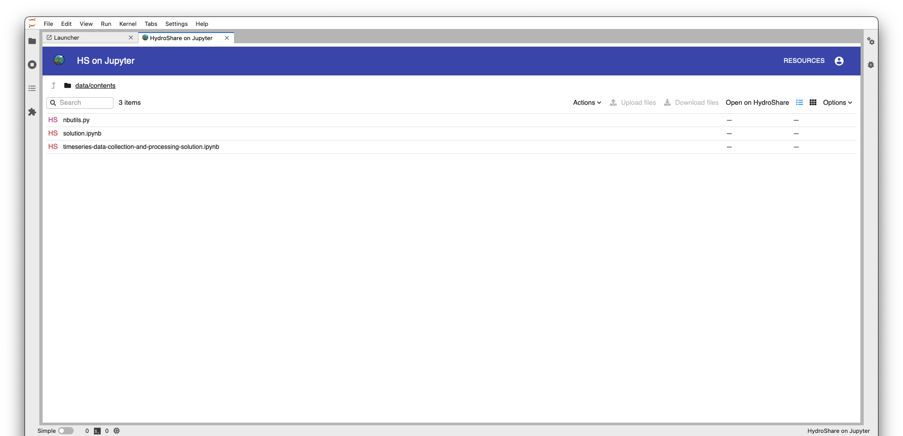
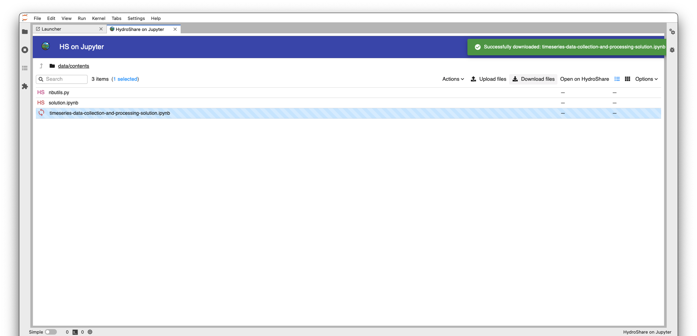
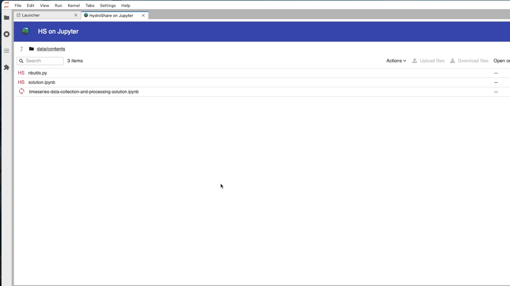

HydroShare-on-Jupyter is a graphical interface for managing HydroShare data within Jupyter computing
environments. Use it on CUAHSI’s JupyterHub or install it locally to use it on your own computer.
The application enables you to easily download and open HydroShare resources, edit files in Jupyter,
and synchronize changes with HydroShare. Visit the software's [GitHub
repository](https://github.com/hydroshare/hydroshare_on_jupyter) for configuration, installation,
and other information.

## User Documentation

The main resource view displays HydroShare resources that your user account can edit. Here, you can
sort by resource title, creator, creation date, and last modified date. Browse a resource's files by
clicking on it's title.

Use the checkboxes to the left of resource titles' to select and download entire resources.
Resources can be re-downloaded, however all files within the local copy of the resource will be
overwritten.

The resource entity view displays a resource's files and folders. Double click on a folder to
navigate within it; Use the upward pointing arrow in the upper left corner to navigate up a level in
the directory tree. To go back to the resource view, select *Resources* in the upper right corner.

Icons to the left of entities
(files and folders) show their sync status. There are four icons: HS, 
,
, and
.
HS denotes that a file is on HydroShare and has not been downloaded locally. 

denotes that a file is only on the local filesystem and not on HydroShare.

denotes that a file is in-sync with HydroShare, meaning it is the same both locally and on HydroShare.
Lastly, 
denotes that a file is out-of-sync with HydroShare, meaning the file is on HydroShare but differs from the local version.

To download/upload one or more entities, select them with a single click. Notice in the upper right
corner, the download and upload files buttons become tappable. Once you've selected the entities,
tap on the desired action. A toast will be displayed from the upper right corner displaying the
result of the action.

Double clicking on a local file will open it in a new JupyterLab tab for viewing / editing. A large majority of file formats are supported for viewing / editing, however there are exceptions.

