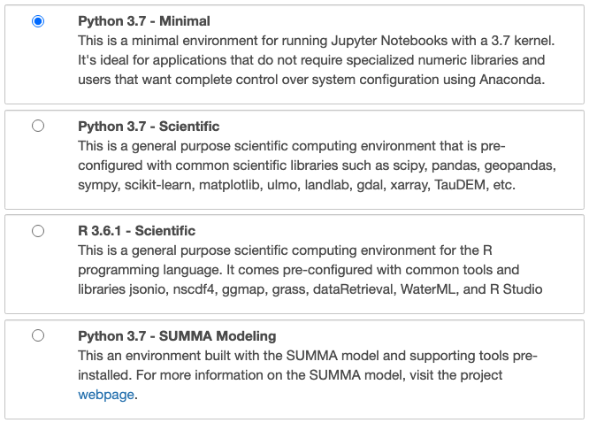

# Profile Environments

The CUAHSI JupyterHub uses profile environments to provide separate purpose-built compute environments. Each profile environment is specially configured with a system libraries, programming languages, and/or model executables designed for specific use cases that range from education to research. When first launching a compute instance (see below), users are presented with a choice of profile environments which will define the configuration and tools they will have access to. A brief description of each environment is provided on the launching page, for additional details see [cuahsi stacks](https://github.com/cuahsi/cuahsi-stacks).

## Choosing a Profile

todo

## Switching Profiles

You may want to change the profile environment of a currently running compute instance. This is accomplished by simply stopping your current instance and restarting it with a different environment profile. To do this, navigate to the hub control panel [https://jupyterhub.cuahsi.org/hub/home](https://jupyterhub.cuahsi.org/hub/home). This can be done using the `notebook` and `lab` user interface menus or by directly entering the URL above. You will be show two buttons My Server" and "Stop My Server", select the latter.

This will shutdown your compute instance and may take several minutes. Once it's shutdown, you'll see a button named "Start My Server". This will take you back to the original launch page where you can select a new profile environment. Note, data created in one environment will persist in others as well.

