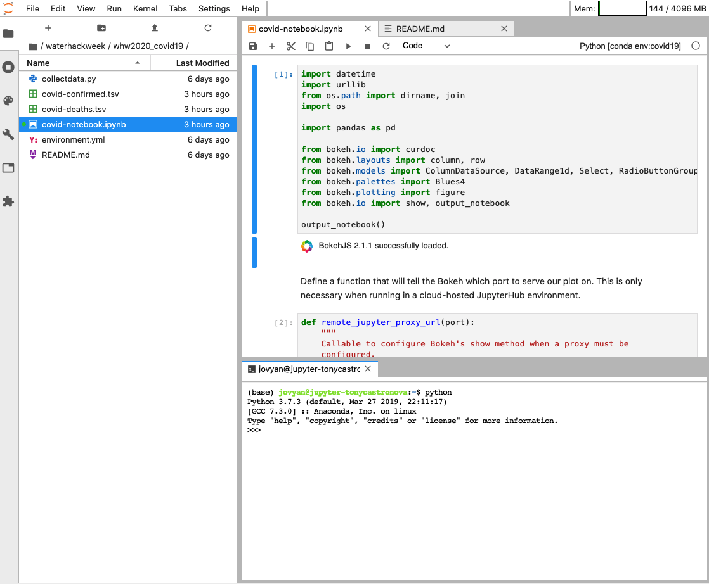
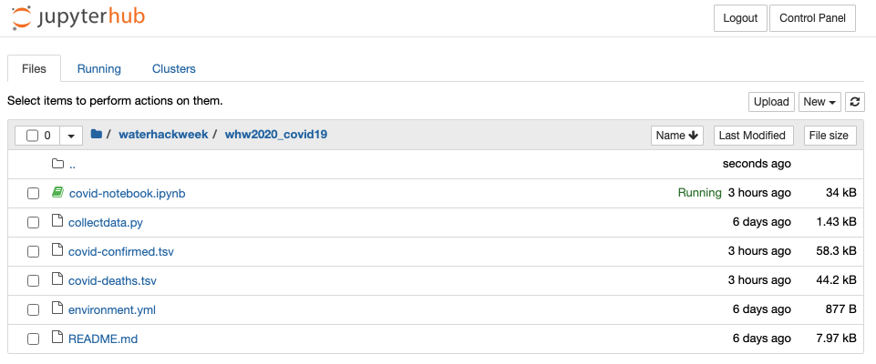
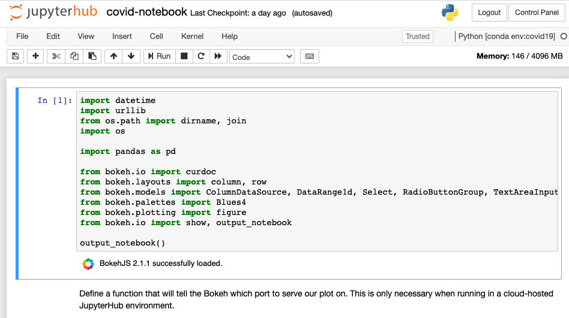
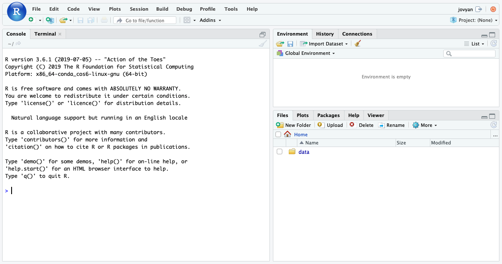

# User Interface

The CUAHSI JupyterHub platform offers several different user interfaces. These user interfaces change the look and feel of the compute environment and provide additional layers functionality. User interface choice is often a personal preference so we use the `lab` as the default since it's functionality is somewhere in the middle of the spectrum. More detail on the supported interfaces is provided below.

## Lab

Lab is the "next-generation" interface for project Jupyter. It has a modular structure that mimics a typical integrated development environment, consisting of dockable notebook tabs, directory view, and workspaces. The `lab` interface is loaded by default for many of the CUAHSI JupyterHub profile environments, however it can be explicitly defined by adding `/lab` to the end of the navigation URL. For more information regarding the capabilities of Jupyter Lab, see this [article](https://towardsdatascience.com/jupyter-lab-evolution-of-the-jupyter-notebook-5297cacde6b) on towardsdatascience.com.

## Notebook

Notebook is the classic Jupyter interface and consists of two primary components: the notebook dashboard and editor. The notebook dashboard is a directory view that allows you to navigate between files and folders inside the hub. The notebook editor allows you to edit and execute Jupyter notebooks. In the CUAHSI JupyterHub, you can switch to this view by appending `/tree` to the navigation URL. For more information regarding the capabilities of the Jupyter Notebook view, see the JupyterHub [documentation](https://jupyter-notebook.readthedocs.io/en/stable/ui_components.html).

## RStudio

RStudio is a specialize user interface that's styled as an RStudio-style integrated development environment. This user interface is only compatible with the R programming language and is currently only available in the `R 3.6.1 - Scientific` profile environment. This user interface can be selected by appending `/rstudio` to the navigation URL. 

<!--
## Nteract
-->

